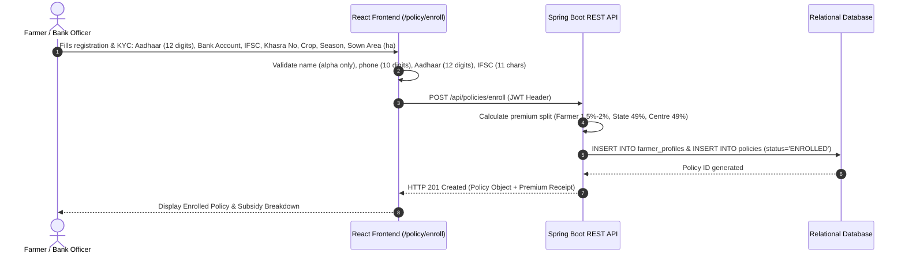
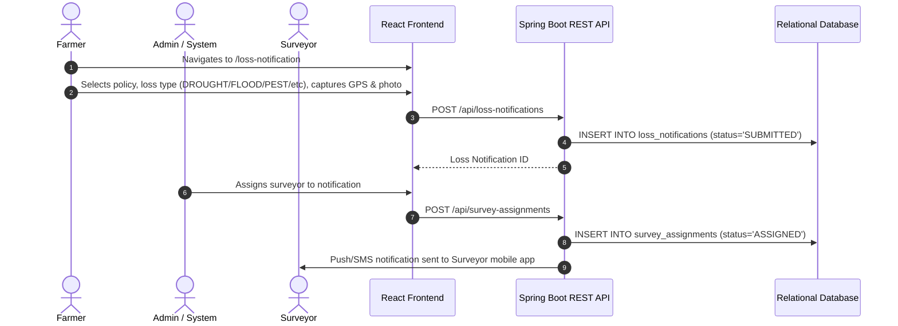
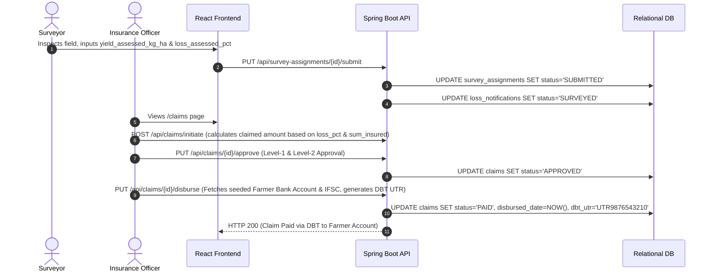

# Document 03 — App Flow & Navigation User Journey Map

**System Name:** Agricultural Crop Insurance and Loss Assessment System  
**Document Version:** 1.1  
**Aligned Standard:** IEEE Std 830-1998 & PMFBY Guidelines 2023  

---

## 1. Overview & Navigation Architecture

The Agricultural Crop Insurance and Loss Assessment System connects 7 user roles (Guest, Farmer, Bank Officer, Surveyor, Insurance Officer, State Officer, System Administrator) into a seamless operational flow. 

### Navigation Bar Structure (NavBar.jsx)
* **Brand / Title:** Agricultural Crop Insurance and Loss Assessment System
* **Public Links:** `Home` (`/`), `Public Schemes` (`/schemes`), `Login` (`/login`), `Register` (`/register`)
* **Authenticated Links (Role-Aware):**
  * **Farmer:** `Dashboard` (`/dashboard`), `Farmer Profile / KYC` (`/profile`), `My Policies` (`/policy`), `File Loss Claim` (`/loss-notification`)
  * **Bank Officer:** `Dashboard` (`/dashboard`), `Enroll Farmer` (`/enrollment`), `Policy Management` (`/policies`)
  * **Surveyor:** `Dashboard` (`/dashboard`), `My Surveys` (`/surveys`), `Submit Field Inspection` (`/survey-submit`)
  * **Insurance Officer:** `Dashboard` (`/dashboard`), `Claim Approvals` (`/claims`), `Disbursements` (`/disbursements`)
  * **State Officer:** `Dashboard` (`/dashboard`), `Analytics & Loss Map` (`/analytics`), `PMFBY Compliance` (`/reports`)
  * **Admin:** `Dashboard` (`/dashboard`), `User Lifecycle` (`/users`), `System Health` (`/system-health`), `Audit Logs` (`/audit-logs`)
* **User Profile Header:** Shows authenticated `User Name`, `Role Badge`, and `Logout Button` (clears JWT from `localStorage` and redirects to `/login`).

---

## 2. Page List & Route Mapping

| Route | Page Component | Access Level | Primary Purpose |
|---|---|---|---|
| `/` | `Home.jsx` | Public (Guest+) | Landing page displaying PMFBY scheme highlights, crop coverage details, and portal sign-in prompts. |
| `/login` | `Login.jsx` | Public | Multi-credential authentication (Email / User ID / Phone + Password) with show/hide password toggle. |
| `/register` | `Register.jsx` | Public | Multi-step role-based registration form capturing name, phone, email, and Aadhaar/Bank details for farmers. |
| `/dashboard` | `Dashboard.jsx` | Authenticated (All Roles) | Dynamic role-specific dashboard with KPI summary cards, quick actions, and recent activity feed. |
| `/policy` | `PolicyPortal.jsx` | Farmer / Bank Officer | View enrolled policies, Khasra survey numbers, crop season breakdown, premium split, and status. |
| `/policy/enroll` | `PolicyEnrollment.jsx` | Farmer / Bank Officer | Form for enrolling land & crop details (Khasra No, State, District, Crop, Sown Area), calculating PMFBY premium caps, and submitting policy. |
| `/loss-notification` | `LossNotification.jsx` | Farmer / Admin | Form to submit crop damage notifications with mandatory GPS location tags and photo uploads. |
| `/surveys` | `SurveyManagement.jsx` | Surveyor / Admin | Surveyor task assignment list with yield assessment entry, GPS verification, and photo evidence attachment. |
| `/claims` | `ClaimTracker.jsx` | Insurance Officer / Admin | Two-level approval workflow UI for review of field survey findings, actuarial checks, and approval/rejection. |
| `/disbursements` | `DBTDisbursement.jsx` | Insurance Officer / State Officer | Direct Benefit Transfer execution dashboard with bank account seeding, UTR tracking, and NPCI validation. |
| `/analytics` | `AnalyticsDashboard.jsx` | Insurance / State Officer / Admin | Real-time KPI charts, loss distribution heatmaps, claim ratio trends, and PMFBY export tool. |
| `/users` | `UserManagement.jsx` | System Admin | Full user lifecycle management: creation, role elevation, suspension, deactivation, and permission matrix. |

---

## 3. Core User Journeys

### User Journey 1: Farmer Registration, KYC & Policy Enrollment

### User Journey 2: Crop Loss Notification & Surveyor Assignment

### User Journey 3: Field Survey, Claim Approval & DBT Payout Workflow

---

## 4. Auth & Error Redirect Logic

### Auth Guard (ProtectedRoute.jsx)
* **Unauthenticated User:** Accessing `/dashboard`, `/policy`, `/claims`, or `/analytics` redirects to `/login?redirect={targetRoute}`.
* **Unauthorized Role:** A Farmer attempting to access `/claims` or `/users` is redirected to `/dashboard` with an alert toast: *"403 Forbidden: You do not have permission to view this page."*

### Error States & Handling
* **Empty States:** Clear UI illustrations with call-to-action buttons (e.g., *"No crop policies found. Click 'Enroll Policy' to get started."*).
* **400 Bad Request:** Form fields display clear red helper text (e.g., *"Name must contain alphabetic characters and spaces only"*, *"Phone Number must be exactly 10 digits long"*, *"Aadhaar must be exactly 12 numeric digits"*).
* **409 Conflict:** Alert banner stating *"Duplicate Claim Record: A claim with this unique identifier already exists."*
* **Session Expiry:** On receiving `401 Unauthorized` from backend API, system automatically clears `localStorage` token and displays modal *"Session Expired. Please log in again."*
