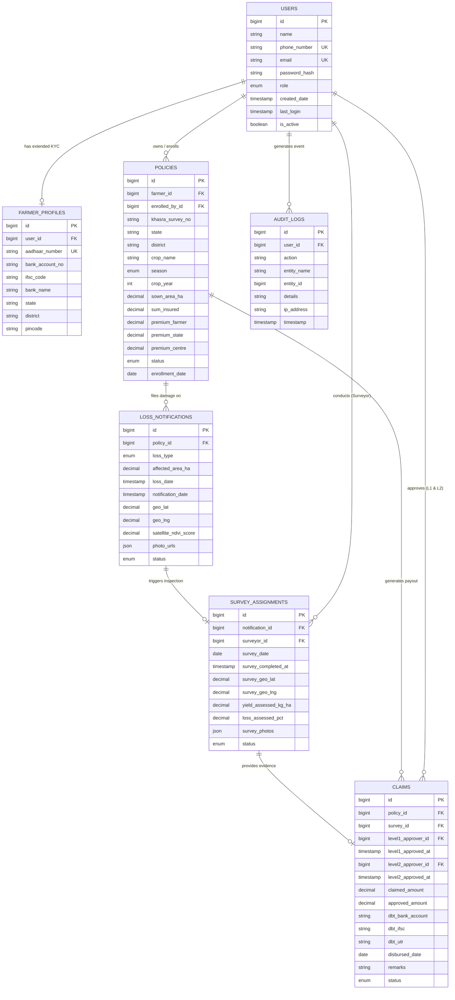

# Document 05 — Backend Schema, Data Model & Auth Architecture

**System Name:** Agricultural Crop Insurance and Loss Assessment System  
**Framework:** Spring Boot 3.x (Java 17+) + Spring Data JPA + Spring Security  
**Database:** Relational (MySQL 8.0+ / PostgreSQL 14+)  
**Compliance Standard:** PMFBY Guidelines 2023 & Aadhaar/DBT Seeding Architecture  

---

## 1. Database Schema & Entity Design



---

## 2. Table Specifications & Column Definitions

### 1. `users` Table (Core Authentication & System Accounts)
| Column Name | Data Type | Constraints | Description |
|---|---|---|---|
| `id` | `BIGINT` | `PRIMARY KEY AUTO_INCREMENT` | Unique User Identifier |
| `name` | `VARCHAR(100)` | `NOT NULL` | Full Name (Alphabetic & spaces only: 2–100 chars) |
| `phone_number` | `VARCHAR(10)` | `UNIQUE NOT NULL` | Mobile Number (Exactly 10 numeric digits, unique for login) |
| `email` | `VARCHAR(150)` | `UNIQUE NOT NULL` | Login Email Address |
| `password_hash` | `VARCHAR(255)` | `NOT NULL` | BCrypt Encrypted Password Hash |
| `role` | `ENUM` | `NOT NULL` | `GUEST`, `FARMER`, `BANK_OFFICER`, `SURVEYOR`, `INSURANCE_OFFICER`, `STATE_OFFICER`, `ADMIN` |
| `created_date` | `TIMESTAMP` | `DEFAULT CURRENT_TIMESTAMP` | Account creation timestamp |
| `last_login` | `TIMESTAMP` | `NULL` | Last successful login timestamp |
| `is_active` | `BOOLEAN` | `DEFAULT TRUE` | Account status flag |

---

### 2. `farmer_profiles` Table (Farmer KYC, Aadhaar & DBT Seeding)
*This table extends `users` specifically for Farmer accounts, storing sensitive KYC and bank account details required for PMFBY DBT compliance.*

| Column Name | Data Type | Constraints | Description |
|---|---|---|---|
| `id` | `BIGINT` | `PRIMARY KEY AUTO_INCREMENT` | Profile Record ID |
| `user_id` | `BIGINT` | `FOREIGN KEY -> users(id)` | Linked Farmer User Account |
| `aadhaar_number` | `VARCHAR(12)` | `UNIQUE NOT NULL` | Aadhaar Card Number (12 numeric digits, AES-256 encrypted at rest) |
| `bank_account_no` | `VARCHAR(18)` | `NOT NULL` | Bank Account Number for Direct Benefit Transfer |
| `ifsc_code` | `VARCHAR(11)` | `NOT NULL` | Bank Branch IFSC Code (11 alphanumeric characters, e.g. `SBIN0001234`) |
| `bank_name` | `VARCHAR(100)` | `NOT NULL` | Bank Name (e.g. State Bank of India, Punjab National Bank) |
| `state` | `VARCHAR(50)` | `NOT NULL` | Residential State |
| `district` | `VARCHAR(50)` | `NOT NULL` | Residential District |
| `pincode` | `VARCHAR(6)` | `NOT NULL` | Postal Index Number (6 digits) |

---

### 3. `policies` Table (Crop Insurance Enrollment & Land Details)
| Column Name | Data Type | Constraints | Description |
|---|---|---|---|
| `id` | `BIGINT` | `PRIMARY KEY AUTO_INCREMENT` | Policy Identification Number |
| `farmer_id` | `BIGINT` | `FOREIGN KEY -> users(id)` | Enrolled Farmer User ID |
| `enrolled_by_id` | `BIGINT` | `FOREIGN KEY -> users(id) NULL` | User ID who processed enrollment (Bank Officer or Farmer) |
| `khasra_survey_no` | `VARCHAR(50)` | `NOT NULL` | Land Record Khasra / Survey Dag Number |
| `state` | `VARCHAR(50)` | `NOT NULL` | Land State Location |
| `district` | `VARCHAR(50)` | `NOT NULL` | Land District Location |
| `crop_name` | `VARCHAR(100)` | `NOT NULL` | Insured Crop (e.g. Paddy/Rice, Wheat, Cotton, Maize) |
| `season` | `ENUM` | `NOT NULL` | `KHARIF`, `RABI`, `ZAID` |
| `crop_year` | `INT` | `NOT NULL` | Policy Crop Year (e.g., 2025, 2026) |
| `sown_area_ha` | `DECIMAL(10,2)` | `NOT NULL` | Insured Sown Area in Hectares |
| `sum_insured` | `DECIMAL(12,2)` | `NOT NULL` | Total Insured Valuation in INR |
| `premium_farmer` | `DECIMAL(12,2)` | `NOT NULL` | Farmer Premium Contribution (Capped at 1.5% - 2%) |
| `premium_state` | `DECIMAL(12,2)` | `NOT NULL` | State Government Subsidy Share (49%) |
| `premium_centre` | `DECIMAL(12,2)` | `NOT NULL` | Central Government Subsidy Share (49%) |
| `status` | `ENUM` | `NOT NULL` | `ENROLLED`, `ACTIVE`, `CLAIM_FILED`, `SETTLED`, `LAPSED` |
| `enrollment_date` | `DATE` | `NOT NULL` | Date policy was activated |

---

### 4. `loss_notifications` Table (Geo-Tagged Damage Reporting)
| Column Name | Data Type | Constraints | Description |
|---|---|---|---|
| `id` | `BIGINT` | `PRIMARY KEY AUTO_INCREMENT` | Loss Notification ID |
| `policy_id` | `BIGINT` | `FOREIGN KEY -> policies(id)` | Linked Policy |
| `loss_type` | `ENUM` | `NOT NULL` | `DROUGHT`, `FLOOD`, `PEST`, `HAILSTORM`, `FIRE`, `OTHER` |
| `affected_area_ha` | `DECIMAL(10,2)` | `NOT NULL` | Damaged Area in Hectares |
| `loss_date` | `TIMESTAMP` | `NOT NULL` | Actual Date/Time when crop damage occurred (for 72h SLA validation) |
| `notification_date` | `TIMESTAMP` | `DEFAULT CURRENT_TIMESTAMP` | Loss submission timestamp |
| `geo_lat` | `DECIMAL(10,8)` | `NOT NULL` | GPS Latitude Coordinate captured on-site |
| `geo_lng` | `DECIMAL(11,8)` | `NOT NULL` | GPS Longitude Coordinate captured on-site |
| `satellite_ndvi_score` | `DECIMAL(3,2)` | `NULL` | Satellite mock NDVI health score (0.00 to 1.00) for cross-verification |
| `photo_urls` | `JSON` | `NOT NULL` | Array of geotagged crop damage photo URLs |
| `status` | `ENUM` | `NOT NULL` | `SUBMITTED`, `SURVEYOR_ASSIGNED`, `SURVEYED` |

---

### 5. `survey_assignments` Table (Field Inspection & Yield Loss Assessment)
| Column Name | Data Type | Constraints | Description |
|---|---|---|---|
| `id` | `BIGINT` | `PRIMARY KEY AUTO_INCREMENT` | Survey Assignment ID |
| `notification_id` | `BIGINT` | `FOREIGN KEY -> loss_notifications(id)` | Parent Loss Notification ID |
| `surveyor_id` | `BIGINT` | `FOREIGN KEY -> users(id)` | Assigned Surveyor User ID |
| `survey_date` | `DATE` | `NOT NULL` | Scheduled ground survey completion date |
| `survey_completed_at` | `TIMESTAMP` | `NULL` | Exact timestamp when surveyor submitted field inspection |
| `survey_geo_lat` | `DECIMAL(10,8)` | `NULL` | GPS Latitude recorded by surveyor during on-site inspection |
| `survey_geo_lng` | `DECIMAL(11,8)` | `NULL` | GPS Longitude recorded by surveyor during on-site inspection |
| `yield_assessed_kg_ha` | `DECIMAL(10,2)` | `NOT NULL` | Measured Crop Yield (kg/ha) |
| `loss_assessed_pct` | `DECIMAL(5,2)` | `NOT NULL` | Final Assessed Loss Percentage (0.00% to 100.00%) |
| `survey_photos` | `JSON` | `NOT NULL` | Array of ground inspection photo evidence URLs |
| `status` | `ENUM` | `NOT NULL` | `ASSIGNED`, `SUBMITTED`, `VERIFIED` |

---

### 6. `claims` Table (Two-Level Actuarial Review & Direct Benefit Transfer Payout)
| Column Name | Data Type | Constraints | Description |
|---|---|---|---|
| `id` | `BIGINT` | `PRIMARY KEY AUTO_INCREMENT` | Financial Claim ID |
| `policy_id` | `BIGINT` | `FOREIGN KEY -> policies(id)` | Associated Policy |
| `survey_id` | `BIGINT` | `FOREIGN KEY -> survey_assignments(id)` | Associated Field Survey |
| `level1_approver_id` | `BIGINT` | `FOREIGN KEY -> users(id) NULL` | Insurance Officer who performed Level-1 Actuarial Verification |
| `level1_approved_at` | `TIMESTAMP` | `NULL` | Timestamp of Level-1 approval |
| `level2_approver_id` | `BIGINT` | `FOREIGN KEY -> users(id) NULL` | Senior Insurance Officer who authorized Level-2 Final Approval |
| `level2_approved_at` | `TIMESTAMP` | `NULL` | Timestamp of Level-2 final authorization |
| `claimed_amount` | `DECIMAL(12,2)` | `NOT NULL` | Claimed Compensation Amount |
| `approved_amount` | `DECIMAL(12,2)` | `NOT NULL` | Actuarial Approved Settlement Amount |
| `dbt_bank_account` | `VARCHAR(18)` | `NOT NULL` | Target Bank Account Credited (Financial Snapshot) |
| `dbt_ifsc` | `VARCHAR(11)` | `NOT NULL` | Target Bank IFSC Code (Financial Snapshot) |
| `dbt_utr` | `VARCHAR(50)` | `NULL` | NPCI/NACH DBT UTR Transaction Reference Number |
| `disbursed_date` | `DATE` | `NULL` | Date compensation was disbursed |
| `remarks` | `VARCHAR(500)` | `NULL` | Actuarial notes or rejection reason |
| `status` | `ENUM` | `NOT NULL` | `INITIATED`, `UNDER_REVIEW`, `LEVEL1_APPROVED`, `APPROVED`, `REJECTED`, `PAID` |

---

### 7. `audit_logs` Table (System Security, User Lifecycle & Regulatory Audit Trail)
| Column Name | Data Type | Constraints | Description |
|---|---|---|---|
| `id` | `BIGINT` | `PRIMARY KEY AUTO_INCREMENT` | Audit Log Record ID |
| `user_id` | `BIGINT` | `FOREIGN KEY -> users(id) NULL` | Actor who performed the action |
| `action` | `VARCHAR(100)` | `NOT NULL` | Event Code (e.g. `USER_LOGIN`, `POLICY_ENROLLED`, `CLAIM_APPROVED_L1`, `DBT_DISBURSED`) |
| `entity_name` | `VARCHAR(50)` | `NOT NULL` | Affected Entity (e.g. `USER`, `POLICY`, `LOSS_NOTIFICATION`, `CLAIM`) |
| `entity_id` | `BIGINT` | `NOT NULL` | Primary Key ID of the affected entity |
| `details` | `VARCHAR(500)` | `NULL` | Detailed contextual metadata or change diff JSON |
| `ip_address` | `VARCHAR(45)` | `NULL` | Client IP Address (IPv4 / IPv6) |
| `timestamp` | `TIMESTAMP` | `DEFAULT CURRENT_TIMESTAMP` | Server event execution timestamp |

---

## 3. Database Normalization & Optimization Analysis

### Normal Form Verification

1. **First Normal Form (1NF):**
   - All columns hold atomic scalar values, except `photo_urls` and `survey_photos` which use native `JSON` arrays.
   - *Pragmatic Engineering Choice:* Storing media URL arrays in `JSON` is supported by MySQL 8.0+ and PostgreSQL, avoiding unnecessary join overhead for read-heavy UI gallery cards while maintaining logical entity structure.

2. **Second Normal Form (2NF):**
   - Every entity uses a single-column surrogate primary key (`id` `BIGINT AUTO_INCREMENT`).
   - Consequently, all non-key attributes are fully dependent on the entire primary key. **2NF is 100% satisfied.**

3. **Third Normal Form (3NF) & Intentional Denormalizations:**
   - **`claims.dbt_bank_account` & `claims.dbt_ifsc` (Intentional Payment Snapshotting):**
     - Storing bank details in `claims` copies values from `farmer_profiles`. While technically a transitive dependency (`policy_id -> farmer_id -> bank_account`), this is an **essential financial audit pattern**. If a farmer updates their bank account in their profile in 2026, past claim records disbursed in 2025 must permanently preserve the exact bank details to which money was transferred.
   - **`claims.policy_id` (Query Shortcut FK):**
     - `claims` links to `survey_assignments`, which links to `loss_notifications`, which links to `policies`. Storing `policy_id` directly in `claims` is a transitive lookup shortcut that optimizes index performance on farmer policy history dashboards without needing a 4-table SQL JOIN.
   - **`farmer_profiles.bank_name` ($IFSC \rightarrow BankName$):**
     - Bank name is functionally dependent on the 4-letter IFSC prefix. Storing `bank_name` alongside `ifsc_code` avoids requiring a external IFSC master table in Phase 1 MVP.

4. **Boyce-Codd Normal Form (BCNF):**
   - BCNF requires that for every functional dependency $X \rightarrow Y$, $X$ must be a superkey. The inline $IFSC \rightarrow BankName$ dependency in `farmer_profiles` is an acceptable minor BCNF trade-off for MVP scope.

---

## 4. Key Constraints & Performance Indexing Strategy

To guarantee strict PMFBY compliance and zero invalid data entries, the following composite database indexes and constraints must be applied:

```sql
-- 1. Multi-credential unique index on users
CREATE UNIQUE INDEX idx_users_email ON users(email);
CREATE UNIQUE INDEX idx_users_phone ON users(phone_number);

-- 2. Prevent duplicate policy enrollment for same farmer, crop, season & year
CREATE UNIQUE INDEX idx_policy_farmer_crop_season_year 
ON policies(farmer_id, crop_name, season, crop_year);

-- 3. Prevent duplicate active loss notifications on the same policy for same loss event
CREATE INDEX idx_loss_policy_status ON loss_notifications(policy_id, status);

-- 4. Fast lookup index for surveyor assignments
CREATE INDEX idx_survey_surveyor_status ON survey_assignments(surveyor_id, status);

-- 5. Audit trail indexing by user and timestamp
CREATE INDEX idx_audit_user_timestamp ON audit_logs(user_id, timestamp);
```

---

## 5. Custom Spring Boot Exception Package (`com.examly.springapp.exception`)

| Custom Exception Class | Extends | HTTP Status | Validation Rule & Trigger |
|---|---|---|---|
| `InvalidNameException` | `RuntimeException` | `400 Bad Request` | Name contains digits or special characters (`Pattern: ^[a-zA-Z\\s]+$`). |
| `InvalidPhoneException` | `RuntimeException` | `400 Bad Request` | Phone number is not exactly 10 numeric digits (`Pattern: ^\\d{10}$`). |
| `InvalidAadhaarException` | `RuntimeException` | `400 Bad Request` | Aadhaar number is not exactly 12 numeric digits (`Pattern: ^\\d{12}$`). |
| `DuplicateClaimException` | `RuntimeException` | `409 Conflict` | Duplicate claim or loss notification for the same policy, crop season & year. |
| `UnauthorisedAccessException` | `RuntimeException` | `403 Forbidden` | Authenticated user attempts API call outside assigned role. |
| `ResourceNotFoundException` | `RuntimeException` | `404 Not Found` | Requesting non-existent Policy ID, Claim ID, or User ID. |

---

## 6. Key Security & Data Protection Policies

1. **Aadhaar Protection:** Aadhaar numbers (`aadhaar_number`) are validated via 12-digit regex and stored using AES-256 field-level encryption at rest in `farmer_profiles`.
2. **DBT Bank Account Validation:** Bank account numbers and IFSC codes are checked against standard RBI IFSC regex (`^[A-Z]{4}0[A-Z0-9]{6}$`) before saving.
3. **Audit Trail Logging:** Every status change and sensitive operation (registration, policy creation, survey submission, claim approval L1/L2, DBT payment) automatically inserts an immutable row into `audit_logs`.
