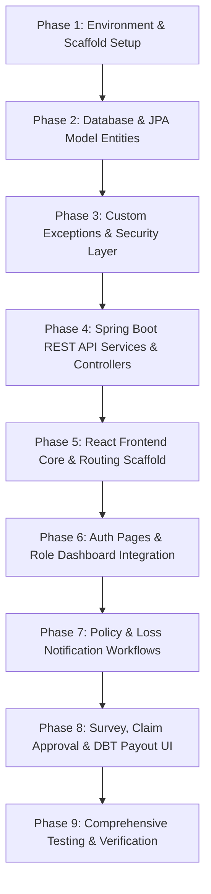

# Document 06 — Implementation Plan & Build Sequence

**System Name:** Agricultural Crop Insurance and Loss Assessment System  
**Document Version:** 1.0  
**Build Strategy:** Incremental Phase-by-Phase Roadmap  

---

## 1. Step-by-Step Implementation Sequence

---

## 2. Detailed Build Phases & Verification Milestones

### Phase 1: Environment Setup & Scaffold Initialisation
* **Tasks:**
  1. Initialize Spring Boot 3.x project structure (`com.examly.springapp`) with dependencies: Spring Web, Spring Security, Spring Data JPA, MySQL Driver, Lombok, Validation, JWT.
  2. Configure `application.properties` with database connection and server port `8080`.
  3. Initialize React application configured for port `8081` with React Router DOM v6.
* **Completion Criteria:** Backend compiles on port `8080`, React runs on port `8081`.

### Phase 2: Database Schema & Entity Classes
* **Tasks:**
  1. Implement JPA Entity classes: `User.java`, `Policy.java`, `LossNotification.java`, `SurveyAssignment.java`, `Claim.java`.
  2. Map foreign key relationships and ENUM types (`Role`, `Season`, `PolicyStatus`, `LossType`, `SurveyStatus`, `ClaimStatus`).
  3. Create Spring Data JPA Repositories for each entity.
* **Completion Criteria:** Hibernate auto-generates tables in MySQL without errors.

### Phase 3: Custom Exception Handling & Spring Security JWT Layer
* **Tasks:**
  1. Create custom exception classes in `com.examly.springapp.exception`:
     * `InvalidNameException`
     * `InvalidPhoneException`
     * `DuplicateClaimException`
     * `UnauthorisedAccessException`
     * `ResourceNotFoundException`
  2. Create `@ControllerAdvice` `GlobalExceptionHandler` returning structured JSON error payloads with timestamps.
  3. Implement `JwtTokenProvider`, `JwtAuthenticationFilter`, and `SecurityConfig`.
* **Completion Criteria:** Invalid names/phones throw 400 Bad Request; unauthenticated API calls return 401/403.

### Phase 4: Backend REST API Controllers & Business Logic
* **Tasks:**
  1. `AuthController`: Register & Login endpoints (`POST /api/auth/register`, `POST /api/auth/login`).
  2. `PolicyController`: Policy enrollment with PMFBY premium calculations (`POST /api/policies/enroll`, `GET /api/policies/farmer/{id}`).
  3. `LossNotificationController`: Mandatory geo-coordinates submission (`POST /api/loss-notifications`).
  4. `SurveyAssignmentController`: Surveyor assignment & field assessment (`POST /api/survey-assignments`, `PUT /api/survey-assignments/{id}/submit`).
  5. `ClaimController`: Claim initiation, multi-level actuarial approval, and DBT disbursement (`POST /api/claims/initiate`, `PUT /api/claims/{id}/approve`, `PUT /api/claims/{id}/disburse`).
* **Completion Criteria:** All API endpoints respond correctly and handle validation logic.

### Phase 5: React Design System & Navigation Architecture
* **Tasks:**
  1. Build global design system in `index.css` (Dark slate theme, CSS grid utilities, glowing status badge classes).
  2. Implement `App.jsx` layout wrapper with `NavBar.jsx` and `Footer.jsx`.
  3. Implement `AuthContext.jsx` for global token and user role management.
  4. Build `ProtectedRoute.jsx` for client-side RBAC enforcement.
* **Completion Criteria:** Public and protected routes function smoothly.

### Phase 6: Authentication & Dynamic Dashboard UI
* **Tasks:**
  1. Build `Login.jsx` with show/hide password toggle and error message banners.
  2. Build `Register.jsx` with real-time input validation (alphabetic name, 10-digit phone).
  3. Build dynamic `Dashboard.jsx` rendering role-customized KPI cards, action buttons, and recent activity feeds.
* **Completion Criteria:** Login redirects users to their role-specific dashboard view.

### Phase 7: Policy Enrollment & Loss Notification Forms
* **Tasks:**
  1. Build `PolicyPortal.jsx` & `PolicyEnrollment.jsx` with automatic premium split calculator.
  2. Build `LossNotification.jsx` with interactive GPS location capture and damage photo upload preview.
* **Completion Criteria:** Farmers can enroll policies and file loss claims with geo-tags.

### Phase 8: Survey, Claim Approvals & Analytics Payout Workflow
* **Tasks:**
  1. Build `SurveyManagement.jsx` for surveyor field assessment.
  2. Build `ClaimTracker.jsx` with two-level approval modals and DBT UTR generator.
  3. Build `AnalyticsDashboard.jsx` with operational trend charts and PMFBY report downloader.
* **Completion Criteria:** Complete end-to-end claim flow executes from loss filing -> survey -> approval -> DBT disbursement.

### Phase 9: Automated Testing & Resume Portfolio Finalization
* **Tasks:**
  1. Write JUnit 5 + Mockito unit tests for backend services and controllers (Target: `> 85%` coverage).
  2. Write React Testing Library tests for key components (Target: `> 75%` coverage).
  3. Create project documentation summary for resume and viva presentation.
* **Completion Criteria:** All automated tests pass; full application executes cleanly.
