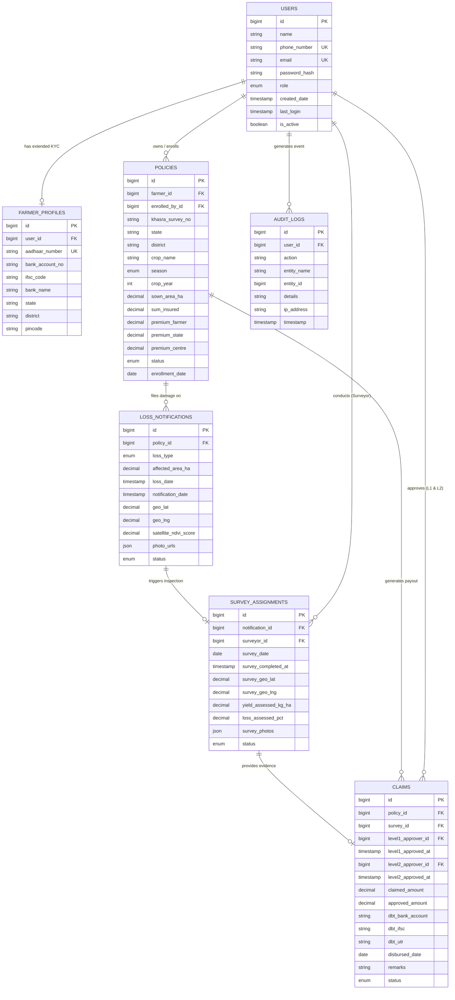

# APPLICATION DEVELOPMENT
## AGRICULTURAL CROP INSURANCE AND LOSS ASSESSMENT SYSTEM
### Database Design Documentation

---

```
                                          APPLICATION DEVELOPMENT
```

---

### 1. ER Diagram (Entity Relationship Diagram)

```
[INSERT ER DIAGRAM HERE]
```

> **Note for Report Formatting:** Below is the Mermaid ER Diagram definition for visual rendering or diagram tool import (Draw.io / StarUML / Visio).



#### Relationship summary:
• A **User (Farmer)** can own many **Policies** over multiple seasons/years; each Policy belongs to exactly one Farmer.  
• A **User (Farmer)** has exactly one **Farmer Profile** containing KYC, Aadhaar, and DBT bank account details.  
• A **Policy** can have multiple **Loss Notifications** filed against it across different loss events; each Loss Notification belongs to exactly one Policy.  
• A **Loss Notification** triggers a **Survey Assignment** for ground yield loss assessment; each Survey Assignment is assigned to one **User (Surveyor)**.  
• A **Policy** and its verified **Survey Assignment** combine to generate a **Claim**; each Claim is verified and authorized by **Users (Insurance Officers - Level 1 & Level 2)**.  
• Any system transaction across entities automatically generates an immutable entry in **Audit Logs** linked to the acting **User**.

---

### 2. Table Descriptions with Sample Data

#### 2.1 Users Table
Stores login credentials, RBAC role, and core profile information for every system actor (`GUEST`, `FARMER`, `BANK_OFFICER`, `SURVEYOR`, `INSURANCE_OFFICER`, `STATE_OFFICER`, `ADMIN`).

| Column | Type | Constraints | Description |
|---|---|---|---|
| `id` | `BIGINT` | `PK, AUTO_INCREMENT` | Unique user identifier |
| `name` | `VARCHAR(100)` | `NOT NULL, alphabetic only` | Full name of the user |
| `phone_number` | `VARCHAR(10)` | `UNIQUE, NOT NULL, 10 digits` | Contact mobile number (login credential) |
| `email` | `VARCHAR(150)` | `UNIQUE, NOT NULL` | Login email address |
| `password_hash` | `VARCHAR(255)` | `NOT NULL` | BCrypt encrypted password hash |
| `role` | `ENUM` | `NOT NULL` | System RBAC Role (`FARMER`, `BANK_OFFICER`, `SURVEYOR`, etc.) |
| `created_date` | `TIMESTAMP` | `DEFAULT NOW()` | Account creation timestamp |
| `last_login` | `TIMESTAMP` | `NULLABLE` | Most recent login timestamp |
| `is_active` | `BOOLEAN` | `DEFAULT TRUE` | Account active flag |

##### Sample Data
```
[INSERT TABLE HERE]
```
| id | name | phone_number | email | role | is_active |
|---|---|---|---|---|---|
| 1 | Muthuvel Karunanidhi | 9876543210 | muthu.k@farmmail.com | FARMER | true |
| 2 | Rajesh Kumar | 9123456780 | rajesh.k@sbi.co.in | BANK_OFFICER | true |
| 3 | Suresh Babu | 9988776655 | suresh.b@agrisurvey.in | SURVEYOR | true |
| 4 | Anita Sharma | 9765432109 | anita.s@cropinsure.gov.in | INSURANCE_OFFICER | true |

---

#### 2.2 Farmer Profiles Table
Extends the `Users` table specifically for Farmer accounts, holding sensitive KYC, Aadhaar, and Direct Benefit Transfer (DBT) bank details.

| Column | Type | Constraints | Description |
|---|---|---|---|
| `id` | `BIGINT` | `PK, AUTO_INCREMENT` | Unique profile record identifier |
| `user_id` | `BIGINT` | `FK -> Users.id` | Linked farmer user account |
| `aadhaar_number` | `VARCHAR(12)` | `UNIQUE, NOT NULL, 12 digits` | Encrypted Aadhaar number (AES-256 at rest) |
| `bank_account_no` | `VARCHAR(18)` | `NOT NULL` | Target bank account number for DBT settlement |
| `ifsc_code` | `VARCHAR(11)` | `NOT NULL, 11 alphanumeric` | Bank branch IFSC code |
| `bank_name` | `VARCHAR(100)` | `NOT NULL` | Bank name (e.g. State Bank of India) |
| `state` | `VARCHAR(50)` | `NOT NULL` | Residential state location |
| `district` | `VARCHAR(50)` | `NOT NULL` | Residential district location |
| `pincode` | `VARCHAR(6)` | `NOT NULL, 6 digits` | Postal index number |

##### Sample Data
```
[INSERT TABLE HERE]
```
| id | user_id | aadhaar_number | bank_account_no | ifsc_code | bank_name | state | district | pincode |
|---|---|---|---|---|---|---|---|---|
| 1 | 1 | 654389123456 | 30981234567 | SBIN0001234 | State Bank of India | Tamil Nadu | Coimbatore | 641001 |

---

#### 2.3 Policies Table
Holds master records for crop insurance policy enrollments, connecting farmers, land Khasra survey numbers, crop details, sum insured, and government subsidy splits.

| Column | Type | Constraints | Description |
|---|---|---|---|
| `id` | `BIGINT` | `PK, AUTO_INCREMENT` | Unique policy identifier |
| `farmer_id` | `BIGINT` | `FK -> Users.id` | Enrolled farmer user ID |
| `enrolled_by_id` | `BIGINT` | `FK -> Users.id, NULLABLE` | User ID who processed enrollment (Bank Officer/Self) |
| `khasra_survey_no` | `VARCHAR(50)` | `NOT NULL` | Land record Khasra / Dag / Survey number |
| `state` | `VARCHAR(50)` | `NOT NULL` | Land state location |
| `district` | `VARCHAR(50)` | `NOT NULL` | Land district location |
| `crop_name` | `VARCHAR(100)` | `NOT NULL` | Insured crop name (e.g., Paddy, Wheat, Maize) |
| `season` | `ENUM` | `NOT NULL` | Season (`KHARIF`, `RABI`, `ZAID`) |
| `crop_year` | `INT` | `NOT NULL` | Policy crop year (e.g., 2025, 2026) |
| `sown_area_ha` | `DECIMAL(10,2)` | `NOT NULL` | Insured sown area in hectares |
| `sum_insured` | `DECIMAL(12,2)` | `NOT NULL` | Total insured valuation (INR) |
| `premium_farmer` | `DECIMAL(12,2)` | `NOT NULL` | Farmer premium contribution share |
| `premium_state` | `DECIMAL(12,2)` | `NOT NULL` | State government subsidy share (49%) |
| `premium_centre` | `DECIMAL(12,2)` | `NOT NULL` | Central government subsidy share (49%) |
| `status` | `ENUM` | `NOT NULL` | Policy status (`ENROLLED`, `ACTIVE`, `CLAIM_FILED`, `SETTLED`, `LAPSED`) |
| `enrollment_date` | `DATE` | `NOT NULL` | Policy activation date |

##### Sample Data
```
[INSERT TABLE HERE]
```
| id | farmer_id | khasra_survey_no | crop_name | season | crop_year | sown_area_ha | sum_insured | premium_farmer | status |
|---|---|---|---|---|---|---|---|---|---|
| 1 | 1 | 142/2A | Paddy (Rice) | KHARIF | 2025 | 2.50 | 125000.00 | 2500.00 | ACTIVE |
| 2 | 1 | 88/1B | Maize | RABI | 2025 | 1.80 | 72000.00 | 1080.00 | CLAIM_FILED |

---

#### 2.4 Loss Notifications Table
Records localized crop damage notifications filed by farmers, incorporating GPS location data, loss event categorization, SLA timestamps, and satellite NDVI scores.

| Column | Type | Constraints | Description |
|---|---|---|---|
| `id` | `BIGINT` | `PK, AUTO_INCREMENT` | Unique loss notification identifier |
| `policy_id` | `BIGINT` | `FK -> Policies.id` | Linked policy ID |
| `loss_type` | `ENUM` | `NOT NULL` | Damage cause (`DROUGHT`, `FLOOD`, `PEST`, `HAILSTORM`, `FIRE`, `OTHER`) |
| `affected_area_ha` | `DECIMAL(10,2)` | `NOT NULL` | Damaged area in hectares |
| `loss_date` | `TIMESTAMP` | `NOT NULL` | Exact timestamp when damage occurred (72h SLA validation) |
| `notification_date` | `TIMESTAMP` | `DEFAULT NOW()` | Submission timestamp |
| `geo_lat` | `DECIMAL(10,8)` | `NOT NULL` | GPS latitude captured on-site |
| `geo_lng` | `DECIMAL(11,8)` | `NOT NULL` | GPS longitude captured on-site |
| `satellite_ndvi_score` | `DECIMAL(3,2)` | `NULLABLE` | Satellite NDVI health score (0.00 to 1.00) |
| `photo_urls` | `JSON` | `NOT NULL` | Geotagged damage photo URLs array |
| `status` | `ENUM` | `NOT NULL` | Notification status (`SUBMITTED`, `SURVEYOR_ASSIGNED`, `SURVEYED`) |

##### Sample Data
```
[INSERT TABLE HERE]
```
| id | policy_id | loss_type | affected_area_ha | loss_date | geo_lat | geo_lng | satellite_ndvi_score | status |
|---|---|---|---|---|---|---|---|---|
| 1 | 2 | FLOOD | 1.50 | 2026-07-20 14:30:00 | 11.016844 | 76.955832 | 0.22 | SURVEYOR_ASSIGNED |

---

#### 2.5 Survey Assignments Table
Tracks ground field inspections assigned to surveyors to record crop yield loss percentage and photo evidence.

| Column | Type | Constraints | Description |
|---|---|---|---|
| `id` | `BIGINT` | `PK, AUTO_INCREMENT` | Unique survey assignment identifier |
| `notification_id` | `BIGINT` | `FK -> LossNotifications.id` | Parent loss notification ID |
| `surveyor_id` | `BIGINT` | `FK -> Users.id` | Assigned surveyor user ID |
| `survey_date` | `DATE` | `NOT NULL` | Scheduled inspection date |
| `survey_completed_at` | `TIMESTAMP` | `NULLABLE` | Timestamp when inspection was submitted |
| `survey_geo_lat` | `DECIMAL(10,8)` | `NULLABLE` | Surveyor GPS latitude on-site |
| `survey_geo_lng` | `DECIMAL(11,8)` | `NULLABLE` | Surveyor GPS longitude on-site |
| `yield_assessed_kg_ha` | `DECIMAL(10,2)` | `NOT NULL` | Measured crop yield (kg/ha) |
| `loss_assessed_pct` | `DECIMAL(5,2)` | `NOT NULL` | Assessed crop loss percentage (0.00% to 100.00%) |
| `survey_photos` | `JSON` | `NOT NULL` | Inspection evidence photos array |
| `status` | `ENUM` | `NOT NULL` | Survey status (`ASSIGNED`, `SUBMITTED`, `VERIFIED`) |

##### Sample Data
```
[INSERT TABLE HERE]
```
| id | notification_id | surveyor_id | survey_date | yield_assessed_kg_ha | loss_assessed_pct | status |
|---|---|---|---|---|---|---|
| 1 | 1 | 3 | 2026-07-22 | 450.00 | 75.00 | SUBMITTED |

---

#### 2.6 Claims Table
Manages financial payout compensation claims, workflow approvals across Insurance Officers (Level 1 & Level 2), and Direct Benefit Transfer (DBT) payment references.

| Column | Type | Constraints | Description |
|---|---|---|---|
| `id` | `BIGINT` | `PK, AUTO_INCREMENT` | Unique claim identifier |
| `policy_id` | `BIGINT` | `FK -> Policies.id` | Associated policy ID |
| `survey_id` | `BIGINT` | `FK -> SurveyAssignments.id` | Associated ground survey ID |
| `level1_approver_id` | `BIGINT` | `FK -> Users.id, NULLABLE` | Insurance Officer (Level-1 actuarial approver) |
| `level1_approved_at` | `TIMESTAMP` | `NULLABLE` | Timestamp of Level-1 approval |
| `level2_approver_id` | `BIGINT` | `FK -> Users.id, NULLABLE` | Senior Officer (Level-2 final approver) |
| `level2_approved_at` | `TIMESTAMP` | `NULLABLE` | Timestamp of Level-2 authorization |
| `claimed_amount` | `DECIMAL(12,2)` | `NOT NULL` | Initial claimed compensation (INR) |
| `approved_amount` | `DECIMAL(12,2)` | `NOT NULL` | Actuarial approved payout (INR) |
| `dbt_bank_account` | `VARCHAR(18)` | `NOT NULL` | Target bank account snapshot for audit |
| `dbt_ifsc` | `VARCHAR(11)` | `NOT NULL` | Target bank IFSC snapshot for audit |
| `dbt_utr` | `VARCHAR(50)` | `NULLABLE` | NPCI / NACH DBT UTR reference number |
| `disbursed_date` | `DATE` | `NULLABLE` | Payout disbursement date |
| `remarks` | `VARCHAR(500)` | `NULLABLE` | Actuarial notes or rejection reason |
| `status` | `ENUM` | `NOT NULL` | Payout status (`INITIATED`, `UNDER_REVIEW`, `LEVEL1_APPROVED`, `APPROVED`, `REJECTED`, `PAID`) |

##### Sample Data
```
[INSERT TABLE HERE]
```
| id | policy_id | survey_id | claimed_amount | approved_amount | dbt_bank_account | dbt_utr | status |
|---|---|---|---|---|---|---|---|
| 1 | 2 | 1 | 60000.00 | 54000.00 | 30981234567 | UTR202607239812 | PAID |

---

#### 2.7 Audit Logs Table
Provides an immutable system trail tracking user logins, policy creations, survey submissions, actuarial claim approvals, and payment disbursements.

| Column | Type | Constraints | Description |
|---|---|---|---|
| `id` | `BIGINT` | `PK, AUTO_INCREMENT` | Unique audit log record identifier |
| `user_id` | `BIGINT` | `FK -> Users.id, NULLABLE` | Actor user ID who executed the action |
| `action` | `VARCHAR(100)` | `NOT NULL` | Action code (`USER_LOGIN`, `POLICY_ENROLLED`, `CLAIM_APPROVED_L1`, `DBT_DISBURSED`) |
| `entity_name` | `VARCHAR(50)` | `NOT NULL` | Affected entity table (`USER`, `POLICY`, `LOSS_NOTIFICATION`, `CLAIM`) |
| `entity_id` | `BIGINT` | `NOT NULL` | Target record primary key ID |
| `details` | `VARCHAR(500)` | `NULLABLE` | Contextual change metadata or JSON snippet |
| `ip_address` | `VARCHAR(45)` | `NULLABLE` | Client IPv4 / IPv6 address |
| `timestamp` | `TIMESTAMP` | `DEFAULT NOW()` | Event execution timestamp |

##### Sample Data
```
[INSERT TABLE HERE]
```
| id | user_id | action | entity_name | entity_id | ip_address | timestamp |
|---|---|---|---|---|---|---|
| 1 | 1 | LOSS_NOTIFICATION_SUBMITTED | LOSS_NOTIFICATION | 1 | 192.168.1.45 | 2026-07-21 09:15:00 |
| 2 | 4 | CLAIM_APPROVED_LEVEL1 | CLAIM | 1 | 10.0.4.12 | 2026-07-23 10:00:00 |

---

### 3. Database Relationships

#### 3.1 Relationship Overview

| Parent Table | Child Table | Foreign Key | Cardinality | Description |
|---|---|---|---|---|
| `Users` | `FarmerProfiles` | `user_id` | 1 : 1 | One farmer user account has exactly one extended KYC profile. |
| `Users` | `Policies` | `farmer_id` | 1 : M | One farmer can hold multiple crop insurance policies over time. |
| `Users` | `Policies` | `enrolled_by_id` | 1 : M | One bank officer or self-user can enroll multiple policies. |
| `Policies` | `LossNotifications` | `policy_id` | 1 : M | One policy can have multiple loss notifications filed across different crop damage events. |
| `LossNotifications` | `SurveyAssignments` | `notification_id` | 1 : 1 | Each loss notification triggers one ground survey inspection assignment. |
| `Users` | `SurveyAssignments` | `surveyor_id` | 1 : M | One surveyor conducts field inspections for multiple survey assignments. |
| `Policies` | `Claims` | `policy_id` | 1 : M | One policy generates claims for valid loss assessment events. |
| `SurveyAssignments` | `Claims` | `survey_id` | 1 : 1 | Each financial claim is backed by exactly one field survey evidence report. |
| `Users` | `Claims` | `level1_approver_id` | 1 : M | One insurance officer reviews and Level-1 approves multiple claims. |
| `Users` | `Claims` | `level2_approver_id` | 1 : M | One senior officer authorizes Level-2 payout for multiple claims. |
| `Users` | `AuditLogs` | `user_id` | 1 : M | One user generates multiple audit log entries over time. |

---

#### 3.2 Referential Integrity Rules
• A **Loss Notification** cannot be filed against a Policy that is `LAPSED` or `SETTLED`.  
• A **Loss Notification** must be submitted within **72 hours** of the reported `loss_date` to satisfy PMFBY SLA guidelines.  
• A **Policy** cannot be enrolled twice for the same farmer, land Khasra survey number, crop, season, and crop year (enforced by `idx_policy_farmer_crop_season_year`).  
• A **Claim** cannot be approved at Level-2 unless Level-1 verification (`level1_approved_at` & `level1_approver_id`) has been successfully recorded.  
• Deleting a `User`, `Policy`, or `SurveyAssignment` that is referenced in active `Claims` or `AuditLogs` is strictly **restricted (`ON DELETE RESTRICT`)** to preserve immutable legal and financial audit records.  
• Direct Benefit Transfer (DBT) bank details (`dbt_bank_account`, `dbt_ifsc`) recorded in `Claims` are stored as an immutable financial snapshot at the time of claim creation, preventing retro-active updates if the farmer updates their profile bank account later.

---

#### 3.3 Normalisation Notes

The Agricultural Crop Insurance schema is normalized to **Third Normal Form (3NF)** (with BCNF principles enforced where applicable) to maintain strict data integrity, eliminate update anomalies, and streamline financial auditing.

##### First Normal Form (1NF) — Atomic Values & Primary Keys
• Every column across all tables stores scalar atomic values, except media fields (`photo_urls`, `survey_photos`) which leverage native `JSON` array types supported by MySQL 8.0+/PostgreSQL.  
• There are no repeating groups or comma-separated lists stored in single text columns.  
• Every entity table has a clearly defined surrogate primary key (`id` `BIGINT AUTO_INCREMENT`).

##### Second Normal Form (2NF) — Full Dependency on Primary Key
• All tables use single-column primary keys (`id`), preventing any partial key dependencies.  
• Non-key attributes (e.g., `sown_area_ha` in `Policies`, `loss_assessed_pct` in `SurveyAssignments`) depend entirely on the specific entity's primary key (`id`), rather than foreign keys like `farmer_id` or `surveyor_id`.

##### Third Normal Form (3NF) & Intentional Pragmatic Denormalizations
• **No Transitive Dependencies:** Non-key fields depend directly on the entity primary key. User details (`name`, `phone_number`, `email`) exist only in `Users` and are referenced elsewhere via foreign keys (`farmer_id`, `surveyor_id`, `level1_approver_id`).  
• **Intentional Financial Payment Snapshotting (`Claims.dbt_bank_account` & `Claims.dbt_ifsc`):**  
  Copying bank details from `FarmerProfiles` into `Claims` is an intentional design choice for compliance. While technically introducing a transitive dependency (`policy_id -> farmer_id -> bank_account`), it ensures that historical disbursement records permanently retain the exact bank account details to which money was wired, regardless of future farmer profile updates.  
• **Query Performance Shortcut (`Claims.policy_id`):**  
  Directly linking `Claims` to `Policies` via `policy_id` avoids requiring a 4-table SQL JOIN (`Claims -> SurveyAssignments -> LossNotifications -> Policies`) for fast dashboard lookups.

##### Benefits of this Normalisation Level
• **Avoidance of Update Anomalies:** Updating a farmer's mobile number or email requires modifying a single row in `Users`, automatically reflecting across all policy and claim views.  
• **Avoidance of Insert Anomalies:** A farmer can be created and undergo KYC verification (`FarmerProfiles`) before enrolling in any crop insurance policy.  
• **Avoidance of Delete Anomalies:** Cancelling or lapsing a policy does not erase historical loss notifications, ground survey records, or user accounts.  
• **Storage & Audit Efficiency:** Master data is stored once, while financial payouts and audit trails are preserved immutably.
